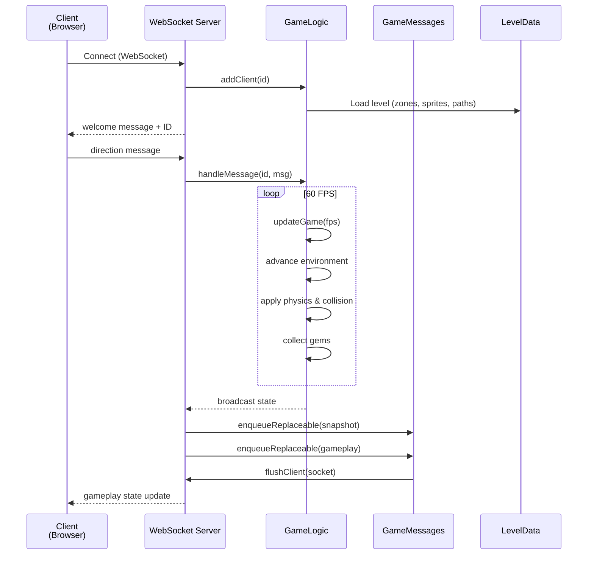
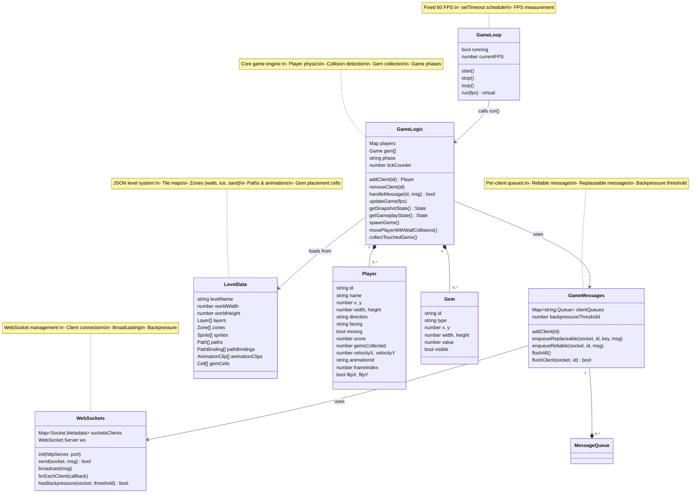
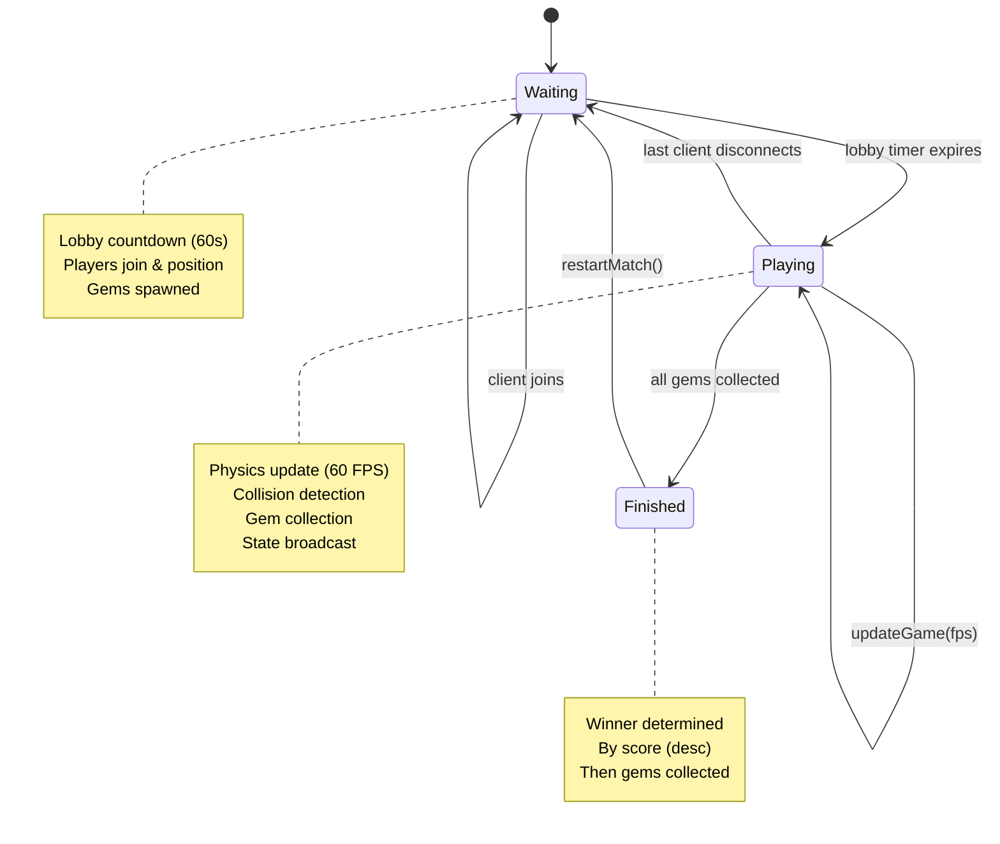

# Architecture


## Project Structure

```
server_nodejs/
    ├── server/
    │   ├── app.js              # Entry point — Express + WebSocket orchestration
    │   ├── gameLogic.js        # Core game engine (physics, collision, gems, players)
    │   ├── utilsGameLoop.js    # 60 FPS game loop scheduler
    │   ├── utilsWebSockets.js  # WebSocket server wrapper
    │   ├── utilsGameMessages.js# Message queue with backpressure
    │   ├── multiplayerLevelData.js # JSON-based level/data loader
    │   └── assets/levels/      # Level definitions (game_data.json, tilemaps)
    ├── public/
    │   ├── index.html          # Game client (HTML5 canvas / CanvaKit)
    │   ├── admin.html          # Admin panel
    │   └── canvaskit/          # WebGL canvas rendering
    └── package.json            # NPM dependencies (express, ws, uuid)
```

## Components

### Server-Side

| Module | Description |
|--------|-------------|
| `app.js` | Main entry point. Express HTTP server, WebSocket initialization, game loop start, admin API. |
| `gameLogic.js` | Core game engine. Manages player physics, collision detection, gem collection, game phases (waiting → playing → finished). |
| `utilsWebSockets.js` | WebSocket server wrapper. Handles client connections, message routing, and broadcasting. |
| `utilsGameMessages.js` | Per-client message queues with backpressure control. Supports reliable and replaceable messages. |
| `utilsGameLoop.js` | Fixed 60 FPS game loop scheduler using `setTimeout`-based timing. |
| `multiplayerLevelData.js` | Level data loader. Parses JSON-based level definitions including zones, paths, sprites, and animation clips. |

### Client-Side

| File | Description |
|------|-------------|
| `public/index.html` | Game client rendered via CanvaKit (WebGL canvas). |
| `public/admin.html` | Admin panel for match control. |

## Architecture Diagram

```mermaid
graph TB
    subgraph Client["Client Browser"]
        IC[index.html<br/>Game Client]
        AH[admin.html<br/>Admin Panel]
    end

    subgraph Server["Node.js Server"]
        APP[app.js<br/>Entry Point]:::entry
        EXPRESS[Express HTTP<br/>Server]
        WS[WebSocket<br/>Server]
        GLOOP[GameLoop<br/>60 FPS Loop]:::core
        GLOGIC[GameLogic<br/>Game Engine]:::core
        GMESG[GameMessages<br/>Message Queue]:::core
        WSUTIL[WebSockets<br/>Wrapper]:::core
        LEVEL[MultiplayerLevelData<br/>Level Loader]:::core

        subgraph Levels["Level Data (JSON)"]
            GAME_DATA[game_data.json]
            ZONES[zones/*.json]
            PATHS[paths/*.json]
            TILEMAPS[tilemaps/*.json]
            ANIM[animations.json]
        end

        subgraph Public["Static Files"]
            CANVAS[CanvaKit / WebGL]
            ICONS[Icons / Assets]
        end
    end

    IC <-->|WebSocket| WS
    AH <-->|HTTP REST| EXPRESS

    APP --> EXPRESS
    APP --> WS
    APP --> GLOOP
    APP --> GMESG

    WS --> WSUTIL
    WSUTIL -->|onConnection| GLOGIC
    WSUTIL -->|onMessage| GLOGIC
    WSUTIL -->|onClose| GLOGIC

    GLOOP -->|run(fps)| GLOGIC

    GLOGIC --> GMESG
    GMESG -->|flush| WSUTIL
    GLOGIC --> LEVEL
    LEVEL --> GAME_DATA
    LEVEL --> ZONES
    LEVEL --> PATHS
    LEVEL --> TILEMAPS
    LEVEL --> ANIM

    EXPRESS -->|static| Public
    Public --> CANVAS

    classDef entry fill:#00ff88,stroke:#003300,stroke-width:2px,color:#000
    classDef core fill:#334433,stroke:#00ff88,stroke-width:1px,color:#fff
```

## Data Flow



## Object Relationships



## Game States



## Message Types (Client → Server)

| Type | Description |
|------|-------------|
| `welcome` | Server sends client ID on connect |
| `newClient` | Broadcast when a new client connects |
| `direction` | Client movement input (up, down, left, right + diagonals) |
| `register` | Client registration with player name |
| `restartMatch` | Request to restart the match (from admin) |
| `snapshot` | Full state (players + gems) |
| `gameplay` | Per-player state (position, score, animations) |
| `disconnected` | Client disconnected notification |

## Level System

Levels are defined in JSON files under `server_nodejs/server/assets/levels/`:

| File | Content |
|------|---------|
| `game_data.json` | Level config: viewport, sprites, layers, gem zone |
| `zones/*.json` | Zone definitions (walls, ice, sand, moving platforms) |
| `paths/*.json` | Path definitions for animated elements |
| `tilemaps/*.json` | Tile map grids for rendering layers |
| `animations.json` | Animation clips with frames, hitboxes, FPS |

### Zone Types

- **Wall** (`mur` / `wall`): Blocks player movement
- **Ice** (`ice` / `gel` / `hielo`): Low friction, high deceleration
- **Sand** (`sand` / `sorra` / `arena`): Speed reduction (48%)

### Gem Types

| Type | Count | Value |
|------|-------|-------|
| blue | 500 | 1 |
| green | 250 | 2 |
| yellow | 100 | 3 |
| purple | 50 | 5 |

## Deployment

The server is designed for deployment on a **Proxmox** virtual environment:

- HTTP server on port 3000 (configurable via `PORT` env)
- Admin password via `WEB_ADMIN_PASSWORD` env
- WebSocket for real-time multiplayer
- Level data loaded from JSON files at startup

See `proxmox/TeoriaProxmox.md` for detailed deployment instructions.

## Dependencies

| Package | Purpose |
|---------|--------|
| `express` | HTTP server and static file serving |
| `ws` | WebSocket server |
| `uuid` | Unique client ID generation |
