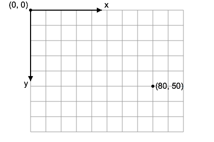
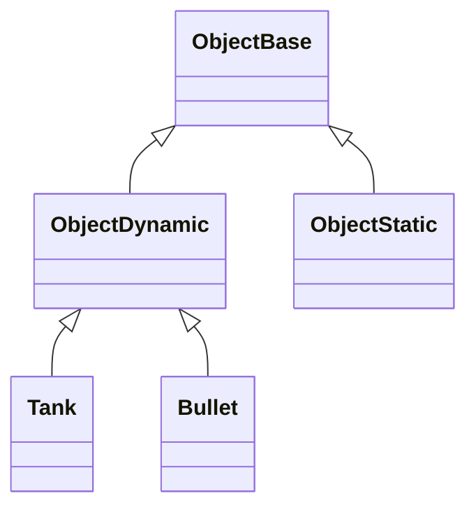
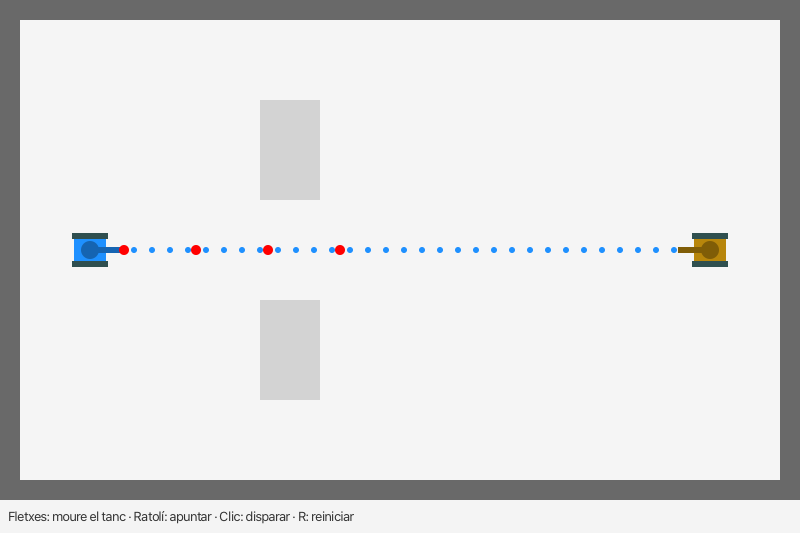

<div style="display: flex; width: 100%;">
    <div style="flex: 1; padding: 0px;">
        <p>© Albert Palacios Jiménez, 2023</p>
    </div>
    <div style="flex: 1; padding: 0px; text-align: right;">
        
    </div>
</div>
<br/>

# Canvas

El **Canvas** és una classe en JavaFX que proporciona una superfície de dibuix sobre la qual es poden fer formes, imatges i text. És similar a un llenç de pintura on es poden dibuixar diferents elements gràfics utilitzant operacions de dibuix proporcionades per la classe *GraphicsContext*.

El **Canvas** és útil per fer dibuixos dinàmics, gràfics en temps real, jocs, situacions on els elements gràfics es generen programàticament.

El **Canvas** o objectes similars existeixen en gairebé tots els llenguatges de programació amb interfícies visuals, també en pàgines web.

Exemples d'aplicacions amb dibuixos personalitzats:

<br/>
<center>
<br/></center>
<center>
<br/></center>
<center>
<br/></center>
<br/>
<br/>

## Canvas a JavaFX

Per fer servir el *Canvas* cal definir un objecte **"Canvas"** a la vista:

```xml
<Canvas fx:id="canvas" height="400.0" width="500.0" ... />
````

Al controlador, cal mantenir una referència al *"context de dibuix"* del *Canvas*:

```java
private GraphicsContext gc;

@Override
public void initialize(URL url, ResourceBundle rb) {
    gc = canvas.getGraphicsContext2D();
}
```

Quan volem dibuixar al *Canvas* fem servir el context anterior:

```java
    // Dibuixar un quadrat
    gc.setFill(color);
    gc.fillRect(x, y, size, size);
```

```java
    // Dibuixar un cercle
    gc.setFill(color);
    gc.fillOval(x, y, size, size);
```

Al canvas si poden anar 'pintant' els objectes a sobre dels antics, així si volem netejar-lo i començar de nou:

<br/>
<center>
<br/></center>
<br/>
<br/>

Les coordenades del canvas són "Top-Left" això vol dir que la posició (0,0) està a dalt a l'esquerra.

<br/>
<center>
<br/></center>
<br/>
<br/>

```java
@FXML
private void actionClear(ActionEvent event) {
    // Netejar tot el Canvas
    gc.clearRect(0, 0, canvas.getWidth(), canvas.getHeight());
}
```
Com que anem canviat la configuració del canvas (amb els colors, transformacions, ...) podem guardar i recuperar l'estat de dibuix amb:
```java
// Guardar la configuració de dibuix actual
gc.save();
// Fer operacions que modifiquen la configuració de dibuix
// com per exemple canviar el color d'emplenat, la mida d'un text, ...
gc.restore();
// Recuperar la configuració de dibuix previa al 'save'
```

## Exemple 0600

Aquest exemple és un projecte bàsic que inicia un canvas amb un dibuix, i té un botó per afegir cercles i quadres de manera aleatòria.

Els polígons es poden afegir amb el botó *"Add"* o bé fent click sobre l'àrea de dibuix. Per detectar la posició, es fa servir un gestor d'events sobre el canvas:

```java
    canvas.addEventHandler(MouseEvent.MOUSE_CLICKED, event -> {
        drawPolygon(event.getX(), event.getY());
        // Crida la funció 'drawPolygon' amb la posició (x,y) on s'ha
    });
```

<br/>
<center>
<br/></center>
<br/>
<br/>

## Exemple 0601

Aquest exemple és un projecte on es fa servir un timer per actualitzar una animació i mostar els FPS (frames per segon) de dibuix.

Normalment, quan es fan servir *Canvas* amb animacions, es separa el codi en dues parts:

- **Lògica de funcionament**, amb un mètode *run* que calcula les animacions a partir dels *frames per segon (FPS)
- **Instruccions de dibuix**, amb un mètode *draw* que dibuixa els elements visuals de cada objecte

Aquesta separació es fa per dos motius:

- Organitzar el codi segons funcionalitat
- Millorar el rendiment ajuntant totes les instruccions de dibuix

En aquest exemple l'animació és gestionada pel mètode *animationTimer* que crida les funcions *run* i *draw* tans ràpid com pot.

- El mètode **run** obté la data actual d'un objecte calendari i crida el mètode *run* de tots els objectes de la llista d'objectes

- El mètode **draw** neteja l'area de dibuix i crida el mètode *draw* de tots els objectes de la llista d'objectes

```java
public CnvController(Canvas canvas) {

    this.canvas = canvas;
    this.gc = canvas.getGraphicsContext2D();

    animationTimer = new CnvTimer(this::run, this::draw, 0);
    start();
}

// Start animation timer
public void start() {
    animationTimer.start();
}

// Stop animation timer
public void stop() {
    animationTimer.stop();
}

// Run game (and animations)
private void run(double fps) {

    if (animationTimer.fps < 1) { return; }

    // Compute global attributes
    Calendar cal = Calendar.getInstance();
    this.hores = cal.get(Calendar.HOUR_OF_DAY);
    this.minuts = cal.get(Calendar.MINUTE);
    this.segons = cal.get(Calendar.SECOND);
    this.millis = cal.get(Calendar.MILLISECOND);

    // Run per object logic
    for (CnvObj obj : objects) { obj.run(this); }
}

public void draw() {

    // Clean drawing area
    gc.clearRect(0, 0, canvas.getWidth(), canvas.getHeight());

    // Draw objects
    for (CnvObj obj : objects) { obj.draw(this); }

    // Draw FPS if needed
    if (showFps) { animationTimer.draw(gc); }   
}
```

<br/>
<center>
<br/></center>
<br/>
<br/>


## Exemple 0602

El funcionament de *Canvas* és complex, hi ha [tutorials](https://docs.oracle.com/javafx/2/canvas/jfxpub-canvas.htm) a Internet per diferents llenguatges de programació que l'implementen. 

Aquest exemple mostra molts exemples amb el codi de com s'aconsegueix cada tipus dibuix (linies, cercles, imatges, ...)

En aquest cas, enlloc de tenir una llista d'objectes a dibuixar (i dibuixar-los tots), els objectes amb les instruccions de dibuix implementen *"implements CnvObj"* per carregar gestionar un únic objecte amb moltes definicions.

```java
public void draw() {

    // Clean drawing area
    gc.clearRect(0, 0, canvas.getWidth(), canvas.getHeight());

    // Draw grid
    drawGrid();

    // Sempre dibuixem el mateix objecte, però la classe derivada escollida
    selectedObj.draw(this); 

    // Draw FPS if needed
    if (showFps) { animationTimer.draw(gc); }
}

public void actionSetSelection(String value) {
    switch (value) {
        case "Linies":              selectedObj = new CnvObjLinies(); break;
        case "Poligons":            selectedObj = new CnvObjPoligons(); break;
        case "Poligons emplenats":  selectedObj = new CnvObjPoligonsEmplenats(); break;
        case "Quadrats i cercles":  selectedObj = new CnvObjQuadratsCercles(); break;
        case "Imatges":             selectedObj = new CnvObjImatges(); break;
        case "Gradients lineals":   selectedObj = new CnvObjGradientsLineals(); break;
        case "Gradients radials":   selectedObj = new CnvObjGradientsRadials(); break;
        case "Transformacions":     selectedObj = new CnvObjTransformacions(); break;
        case "Texts":               selectedObj = new CnvObjTexts(); break;
        case "Text multilinia":     selectedObj = new CnvObjTextMultilinia(); break;
    }
}
```

<br/>
<center>
<br/></center>
<br/>
<br/>

## Exemple 0603

En aquest exemple s'escolten els events del ratolí per arrossegar els elements que es dibuixen al canvas.

Els *listeners* s'inicien a la funció *initialize*:

```java
    canvas.setOnMousePressed(this::onMousePressed);
    canvas.setOnMouseDragged(this::onMouseDragged);
    canvas.setOnMouseReleased(this::onMouseReleased);
```

Quan succeeix l'event, per exemple arrossegar el mouse, es canvia la posició de l'element seleccionat (segons la posició del mouse):

```java
private void onMouseDragged(MouseEvent event) {
    if (dragging) {
        if (selectedShape == greenSquare) {
            greenSquare.setX(event.getX() - offsetX);
            greenSquare.setY(event.getY() - offsetY);
        } else if (selectedShape == blueCircle) {
            blueCircle.setCenterX(event.getX() - offsetX);
            blueCircle.setCenterY(event.getY() - offsetY);
        }
        drawShapes();
    }
}
```

**Nota:** En aquest exemple també s'escolta l'event de canvi de mida de finestra per assegurar que els objectes sempre són visibles, encara que la finestra es faci petita.

<br/>
<center>
<br/></center>
<br/>

## Exemple 0604

En aquest exemple, es veu com fer una animació simple amb el timer.

<br/>
<center>
<video width="100%" controls allowfullscreen>
  <source src="./assets/exCanvas04.mov" type="video/mp4">
</video>
</center>
<br/>

## Exemple 0605

Aquest exemple és una base mínima per al joc de **Tanks**: un únic *Canvas* amb parets, dos obstacles escollits aleatòriament d'una llista predefinida i dos tancs dibuixats amb formes simples.

- Les fletxes mouen el tanc **amunt, avall, esquerra i dreta** sobre el tauler. El cos s'orienta segons la direcció del moviment.
- El **ratolí** orienta la torreta independentment del cos. Els cercles blaus indiquen la direcció del tret fins al cursor o un obstacle.
- Un **clic** dispara una bala vermella, amb un màxim de **quatre bales actives**. Cada bala pot **rebotar una vegada** contra una paret o un obstacle: inverteix la component de velocitat perpendicular a la superfície i conserva l'altra. Al segon impacte desapareix amb una petita explosió taronja que s'expandeix i s'esvaeix.
- El segon tanc és un objectiu immòbil: quan rep una bala, desapareix amb una petita animació d'explosió. Les bales també poden destruir el tanc del jugador després de rebotar.
- La tecla **R** reinicia l'exemple i torna a escollir els dos obstacles.

Com al 0604, el controlador separa la lògica (`update`) del dibuix (`redraw`) i fa servir `CnvTimer`. La variable `dt` indica el temps transcorregut entre actualitzacions. `update()` mou els objectes i orienta la torreta; `redraw()` representa l'estat del joc.

### Objectes i moviment

La jerarquia separa els objectes segons si es mouen o són estàtics:



- `ObjectBase` defineix la posició (`getPosition()`) i el dibuix (`draw()`).
- `ObjectDynamic` afegeix angle, velocitat, radi i moviment. `Tank` i `Bullet` es representen com a cercles per detectar col·lisions.
- `ObjectStatic` representa directament un rectangle immòbil, tant si és una paret exterior com un obstacle interior. Guarda un `Rectangle2D` i el color, i comprova si un cercle hi xoca.

`nextPosition(dt)` pertany només a `ObjectDynamic`: calcula on arribaria l'objecte després de `dt` segons, sense moure'l encara. Si la nova posició és lliure, el controlador la confirma amb `setPosition()`. El cos del tanc i la torreta tenen angles independents.

El controlador manté una única llista de rectangles estàtics. Sempre hi ha **quatre parets exteriors de color gris fosc** i **dos obstacles interiors de color gris clar**, escollits aleatòriament en reiniciar. En un rectangle, la posició és la cantonada superior esquerra.

### Col·lisions

Cada vegada que s'actualitza el joc, els objectes avancen pocs píxels. Per això n'hi ha prou amb una pregunta molt senzilla: **«A la posició nova, aquest objecte toca alguna cosa?»**

`HelperCollisions` només té dues comprovacions:

- **Cercle-cercle**: dos cercles es toquen si la distància entre els centres és més petita que la suma dels radis.
- **Cercle-rectangle**: es busca el punt del rectangle més proper al centre del cercle (limitant la X i la Y del centre als costats del rectangle). Si aquest punt és a menys d'un radi, es toquen.

```java
// Una bala toca el tanc enemic?
if (bullet.touches(enemy)) { ... }

// Un cercle a la posició "next" toca aquesta paret?
if (wall.touches(next, Bullet.RADIUS)) { ... }
```

### Aplicar les regles del joc

Abans de moure un objecte, calculem la seva posició següent amb `nextPosition(dt)` i la comprovem:

- **Tanc**: si la posició nova toca una paret, un obstacle o l'altre tanc, provem de moure'l només en X i després només en Y. Així el tanc **llisca** al llarg de la paret en lloc de quedar-s'hi enganxat.
- **Bala contra paret**: si és el primer xoc, rebota. Per saber cap on, provem el moviment només en X: si ja xoca, la paret és vertical i invertim la part horitzontal de la direcció. Igual amb Y per a les parets horitzontals. Al segon xoc, la bala desapareix amb una explosió petita.
- **Bala contra tanc**: destrueix l'enemic sempre, i el tanc del jugador només si la bala ja ha rebotat.
- **Bala contra bala**: desapareixen totes dues.

Les bales a eliminar es guarden en una llista i es retiren al final, per no modificar la llista `bullets` mentre la recorrem.

Aquest mètode és senzill però té un límit: si un objecte anés tan ràpid que en un sol pas travessés una paret sencera, no es detectaria el xoc. Amb les velocitats d'aquest exemple i `dt` limitat a 0,05 segons, una bala avança com a màxim 18 píxels per pas, menys que el gruix de les parets.

Per executar-lo des de la carpeta de l'exemple:

```bash
./run.sh com.project.Main
```

A Windows, feu servir `./run.ps1 com.project.Main`.

<br/>
<center>
<br/></center>
<br/>

## Exemple Pong

Aquest exemple mostra una versió de Pong per a un sol jugador, mostra com es poden fer jocs senzills amb *Canvas* i també com capturar les tecles.

Per poder escoltar l'event de tecla, primer s'ha d'haver creat l'escena. Per aquest motiu fem servir *Platform.runLater*. 
```java
// Listen to key events (set when scene is available)
Platform.runLater(() -> {
    UtilsViews.parentContainer.getScene().addEventFilter(KeyEvent.ANY, keyEvent -> { keyEvent(keyEvent); });
});
```

Cada cop que s'apreta o deixa anar una tecla es crida la funció *keyEvent*, que rep la informació de l'event en qüestió (si s'ha apretat o alliberat una tecla, i de quina tecla es tracta):
```java
public void keyEvent (KeyEvent evt) {

    // Quan apretem una tecla
    if (evt.getEventType() == KeyEvent.KEY_PRESSED) {
        if (evt.getCode() == KeyCode.LEFT) {
            cnvController.playerDirection = "left";
        }
        if (evt.getCode() == KeyCode.RIGHT) {
            cnvController.playerDirection = "right";
        }
    }

    // Quan deixem anar la tecla
    if (evt.getEventType() == KeyEvent.KEY_RELEASED) {
        if (evt.getCode() == KeyCode.LEFT) {
            if (cnvController.playerDirection.equals("left")) {
                cnvController.playerDirection = "none";
            }
        }
        if (evt.getCode() == KeyCode.RIGHT) {
            if (cnvController.playerDirection.equals("right")) {
                cnvController.playerDirection = "none";
            }
        }
    }
}
```

<br/>
<center>
<br/></center>
<br/>

## Exemple Sockets

Aquest exemple mostra com poden interactuar dos clients sobre un *Canvas* a través de WebSockets.

Per fer-lo anar, cal obrir tres terminals diferents. Una pel servidor i dues pels clients:

Mantenir el servidor funcionant:
```bash
cd "Exemple Sockets"
./run.sh com.project.Server
```

Un cop el servidor està llest, obrir dos clients:
```bash
cd "Exemple Sockets"
./run.sh com.project.ClientFX
```

<br/>
<center>
<video width="100%" controls allowfullscreen>
  <source src="./assets/exSockets.mov" type="video/mp4">
</video>
</center>
<br/>

**Nota**: Per sortir del servidor escriure 'exit' a la consola.

# Servidors remots

**Important!**: Mireu la teoria de serveis i processos

Aquests scripts ajuden a fer tots els passos d'interacció amb Proxmox de manera senzilla

## Definir la configuració

Editar l'arxiu **./proxmox/config.env** segons la teva configuració

```txt
DEFAULT_USER="nomUsuari"
DEFAULT_RSA_PATH="$HOME/.ssh/id_rsa"
DEFAULT_SERVER_PORT="3000"
```

Executar els arxius a la carpeta **proxmox**

```bash
cd proxmox
./proxmoxConnect.sh         # Inicia una connexió SSH de terminal amb el servidor
./proxmoxDeploy.sh          # Puja el codi al servidor (i el reinicia)
./proxmoxSetupAutostart.sh  # Configura el servidor remot perquè s'inicii automàticament al reiniciar
./proxmoxSetupRedirect80.sh # Configura el servidor remot perquè redireccioni el port 80 cap al port del servidor
```

També podeu pasar la configuració per paràmetres:

```bash
cd proxmox
./proxmoxRedirect80.sh nomUsuari "$HOME/Desktop/Proxmox IETI/id_rsa" 3001
```

**Nota:** Recordeu a aturar el servidor abans de pujar-lo!
