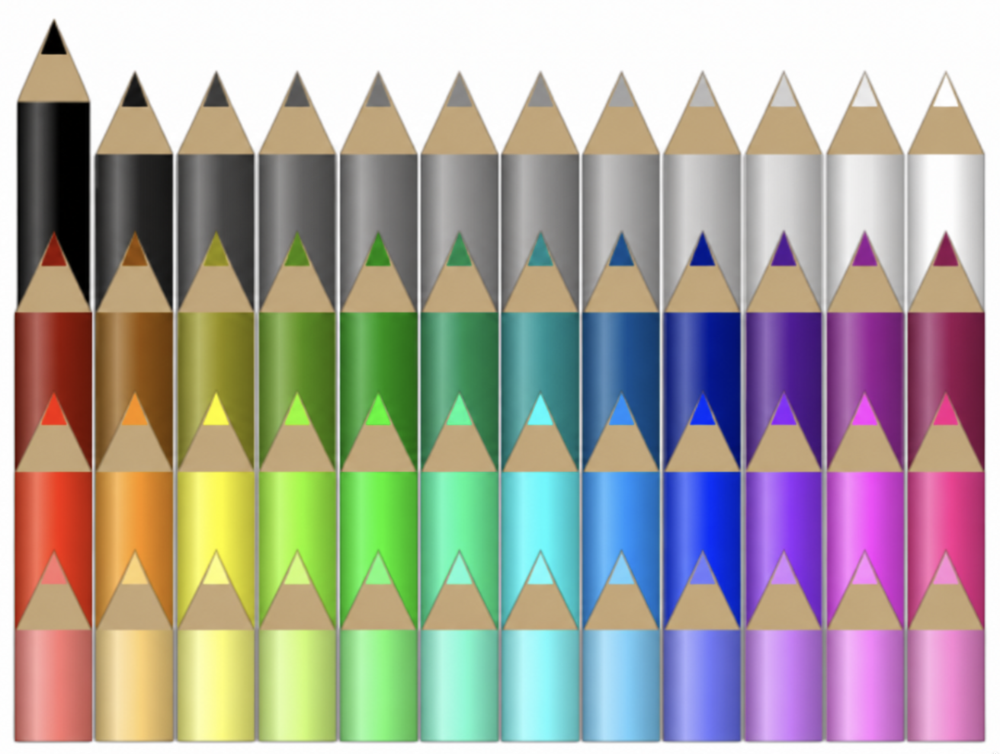

<div style="display: flex; width: 100%;">
   <div style="flex: 1; padding: 0px;">
       <p>© Albert Palacios Jiménez, 2024</p>
   </div>
   <div style="flex: 1; padding: 0px; text-align: right;">
       
   </div>
</div>
<br/>

# Exercici 06 A — Paint

Fes una aplicació de dibuix tipus **Paint** amb **JavaFX i Canvas**.

L'aplicació serà **local i d'un sol usuari**, sense servidor ni comunicació amb WebSockets.

L'usuari ha de poder crear dibuixos amb traços lliures, línies i rectangles, escollir-ne l'estil i gestionar cada objecte dibuixat de manera independent.

## Interfície

L'aplicació ha de tenir una vista amb:

- Un **Canvas** que serveixi com a àrea de dibuix.
- Un selector d'eina: **traç lliure**, **línia** i **rectangle**.
- Un formulari amb les opcions de dibuix.
- Una llista dels objectes dibuixats.
- Un botó per **eliminar l'objecte seleccionat**.
- Una llista amb els colors principals (a part del selector de color de JavaFX)

```text
----------------------|-----------|--------
Area dibuix           |formulari  |llista
                      |estil.     |objectes
                      |-----------|
                      |colors     |
                      |predefinits|
```

Tots els objectes s'han de dibuixar sobre el Canvas. Els controls del formulari i la llista poden ser components habituals de JavaFX.

## Opcions de dibuix

El formulari ha de permetre escollir:

- El **color de la línia o del contorn**.
- El **color d'emplenament**.
- L'**ample de la línia**, amb un valor superior a `0`.

Es poden utilitzar `ColorPicker` per als colors i un `Slider` o un `Spinner` per a l'ample.

Les opcions escollides s'apliquen als nous objectes. Cada objecte ha de conservar el seu propi estil encara que després es canviïn les opcions del formulari.

El color d'emplenament s'aplica als rectangles. Les línies i els traços lliures només utilitzen el color i l'ample de la línia.

## Traç lliure

Amb l'eina de traç lliure seleccionada:

1. En prémer el botó principal del ratolí sobre el Canvas, es comença un traç nou i es desa la posició inicial.
2. Mentre s'arrossega el ratolí amb el botó premut, es desen les seves posicions en una **llista ordenada de punts `(x, y)`**.
3. El traç es dibuixa unint cada punt amb el següent, de manera que es pugui veure mentre es dibuixa.
4. En deixar anar el botó, es desa també la posició final i es dona el traç per acabat.

Cada traç complet ha de ser **un únic objecte** de la llista, encara que contingui molts punts.

## Línia

Amb l'eina de línia seleccionada:

1. En prémer el botó principal del ratolí, es desa la **posició inicial**.
2. Mentre s'arrossega, es mostra una previsualització de la línia entre la posició inicial i la posició actual del ratolí.
3. En deixar anar el botó, es desa la **posició final** i es crea l'objecte línia.

La línia ha de conservar els dos extrems, el color i l'ample de la línia.

## Rectangle

Amb l'eina de rectangle seleccionada:

1. En prémer el botó principal del ratolí, es desa la **posició inicial**.
2. Mentre s'arrossega, es mostra una previsualització del rectangle entre la posició inicial i la posició actual del ratolí.
3. En deixar anar el botó, es desa la **posició final** i es crea l'objecte rectangle.

S'ha de poder dibuixar el rectangle arrossegant en qualsevol direcció. A partir de les dues posicions, es poden calcular:

```text
x = mínim(xInicial, xFinal)
y = mínim(yInicial, yFinal)
ample = valor absolut(xFinal - xInicial)
alçada = valor absolut(yFinal - yInicial)
```

El rectangle ha de mostrar el color d'emplenament i el contorn amb el color i l'ample escollits.

## Llista d'objectes

Cada vegada que s'acaba de dibuixar un objecte, s'ha d'afegir a la llista.

Cada entrada ha de permetre identificar l'objecte amb el seu tipus i un identificador, per exemple:

```text
Traç lliure 1
Línia 2
Rectangle 3
```

La llista ha de permetre **seleccionar un únic objecte**. La selecció de la llista i la del Canvas han de correspondre al mateix objecte.

Els objectes s'han de dibuixar en ordre de creació: els més recents queden per sobre dels anteriors. Seleccionar o moure un objecte no n'ha de canviar l'ordre.

## Selecció i requadre delimitador

Quan se selecciona un objecte a la llista, el Canvas ha de mostrar un **requadre amb línies discontínues** que l'encapsuli.

El requadre s'ha de calcular a partir de les coordenades de l'objecte:

- Per a un traç lliure, amb els valors mínims i màxims de `x` i `y` de tots els punts.
- Per a una línia, amb els valors mínims i màxims de `x` i `y` dels dos extrems.
- Per a un rectangle, amb la seva posició, amplada i alçada.

Cal deixar un petit marge que tingui en compte l'ample del contorn, perquè el requadre encapsuli tot l'objecte i sigui visible també en línies horitzontals o verticals.

El requadre és un indicador de selecció: no és un objecte del dibuix i no s'ha d'afegir a la llista. Quan canvia la selecció, només s'ha de mostrar el requadre del nou objecte seleccionat.

## Moure un objecte

En seleccionar un objecte de la llista, s'activa el mode de moviment.

Per moure'l, l'usuari ha de prémer dins del seu requadre delimitador i arrossegar el ratolí sobre el Canvas.

Durant l'arrossegament:

- S'ha de calcular el desplaçament del ratolí respecte de la posició on ha començat l'arrossegament.
- S'ha de traslladar tot l'objecte amb aquest desplaçament, sense deformar-lo ni fer-lo saltar a la posició del cursor.
- En un traç lliure, s'han de moure tots els punts; en una línia, els dos extrems; i en un rectangle, la seva posició.
- El dibuix i el requadre discontinu s'han d'actualitzar mentre es mou l'objecte.

En deixar anar el botó, l'objecte conserva la nova posició i continua seleccionat.

En escollir una eina de dibuix, es desmarca l'objecte seleccionat i es torna al mode de dibuix. Així, arrossegar per moure un objecte no ha de crear cap objecte nou.

## Eliminar un objecte

El botó d'eliminació ha d'esborrar l'objecte seleccionat tant de la llista com del dibuix.

Després d'eliminar-lo, s'ha de netejar la selecció i ha de desaparèixer el seu requadre discontinu. Si no hi ha cap objecte seleccionat, el botó ha d'estar desactivat.

## Colors predefinits

La llista de colors predefinits s'han de dibuixar amb un canvas propi i tenir un estil semblant a aquest:

<center>
<br/></center>
<br/>

Si el color escollit coincideix amb algun de la llista, s'ha de marcar posant-lo verticalment més amunt que els altres colors de la seva fila.

## Model de dades i redibuixat

El dibuix s'ha de conservar en una **col·lecció d'objectes en memòria**. No n'hi ha prou amb pintar directament sobre el Canvas i perdre les dades de les formes.

Cada objecte ha de guardar les dades necessàries per tornar-lo a dibuixar, moure'l i calcular-ne el requadre delimitador:

- El tipus i l'identificador.
- Les coordenades o la llista de punts, segons el tipus.
- El color de la línia o del contorn i el seu ample.
- El color d'emplenament, quan correspongui.

Quan es crea, es mou o s'elimina un objecte, o canvia la selecció, s'ha de **netejar el Canvas i redibuixar el contingut** a partir d'aquesta col·lecció.

Les previsualitzacions s'han de dibuixar sobre els objectes existents durant l'arrossegament, però només s'han d'afegir a la col·lecció i a la llista en deixar anar el botó. El requadre de selecció s'ha de dibuixar al final, amb un estil propi que no modifiqui el dels objectes.

## Entrega

Cal fer un repositori al GitHub de l'alumne.

S'ha d'entregar la URL del repositori de GitHub al Moodle.

S'ha de presentar presencialment de manera individual, caldrà respondre les preguntes.